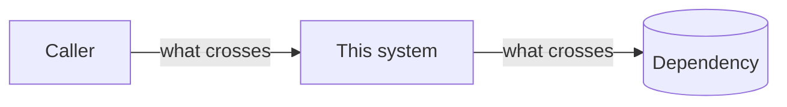

# <System name>

> **Status:** Current | Target | Deprecated — one line saying which, and linking the ADR or plan.

## Purpose

What problem this system solves and for whom, in two or three sentences.

## Context

Where it sits: who calls it and what it calls. One `flowchart`, at the zoom level that shows its
neighbours and no more.

## How it works

The main flow as a `sequenceDiagram`, followed by prose that explains only the non-obvious steps.

## States

Only if the system is stateful: a `stateDiagram-v2`, with what drives each transition.

## Failure modes

| Failure | What the user sees | What the system does | What an operator does |
|---|---|---|---|
| … | … | … | link a runbook |

## Configuration

The settings it reads, linking the service's `.env.example` rather than restating
defaults.

## Code

Entry points, named as the code names them: `module/file.py` `function_name`.

## Decisions

The ADRs that fix its shape.
